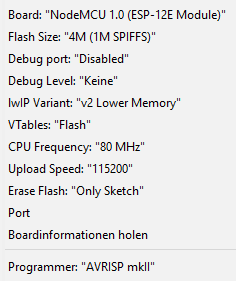
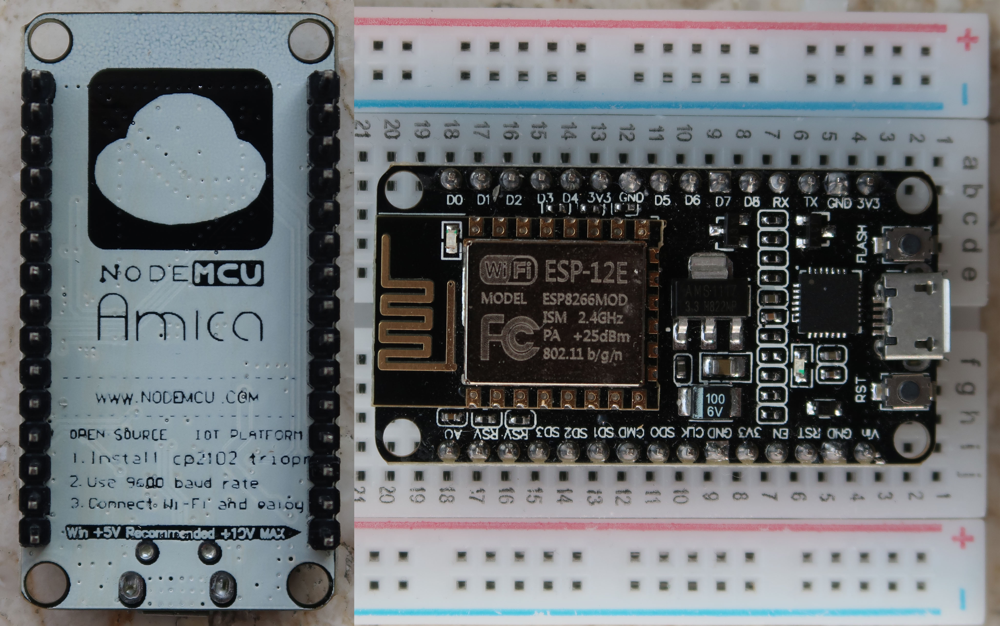
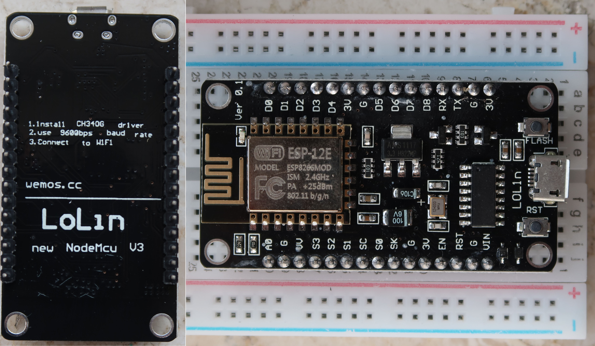

# Experiments with ESP8266 boards

## Boards
I ordered two different boards from China in September 2018, both referred to as "NodeMcu V3" by the seller. [This article](https://frightanic.com/iot/comparison-of-esp8266-nodemcu-development-boards/#adafruit-sparkfun) has more infos on different NodeMCU boards.

### Amica NodeMcu
- __Price:__ € 2,41
- __USB-Serial converter:__ CP2104
- __Arduino IDE Settings:__

    

    

### LoL1n NodeMcu V3
- __Price:__ € 2,19
- __USB-Serial converter:__ CH340
- This board is two units wider than the other ones. It fits on a common breadboard but there is no space to connect something to the pins comfortably.

    

### Adafruit Feather HUZZAH
- __Price:__ $ 16,95 at Adafruit; 20-30€ at amazon.de or ebay.de
- __USB-Serial converter:__ CP2104
- More info at the [Adafruit site](https://www.adafruit.com/product/2821). I could work with this one at school. Size and layout look similar to the Amica. It seems to have a LiPo Battery connector and they also sell a bunch of cool [shields and accessoirs](https://www.adafruit.com/category/943) for it and other boards with the same form factor.
The price is way higher than the others though.

## Development Environment
The Arduino IDE works fine but I'm using Visual Studio Code with Arduino plugin among others. It works real nice so far. I just had to add "AppData\\Local\\Arduino15\\packages\\" to includePath in c_cpp_properties.json so the headers are found.

## Useful bits of information
### Wifi settings on the ESP8266 are saved to flash memory
Once you've connected to a network the SSID and passphrase are written to flash and will automatically be used in the future. In this case it seems to be enough to call `WiFi.begin()` instead of `WiFi.begin(ssid, password)` to connect to network. This saves you from having your password in the Code. (This behaviour can be changed with [persistent](https://arduino-esp8266.readthedocs.io/en/latest/esp8266wifi/generic-class.html#persistent)).